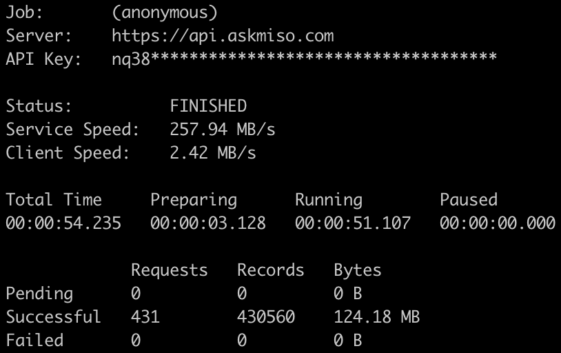

# Miso JavaScript SDK for Node.js
Enhance your site with high conversion magic with [Miso's](https://miso.ai/) power. This server-side SDK is at its beta stage and will go official sometime soon.

<p>
  <a href="https://www.npmjs.com/package/@miso.ai/client-sdk"></a>
  <a href="/LICENSE"></a>
</p>

[Home](https://miso.ai/) |
[Docs](https://docs.miso.ai/) |
[SDK Reference](https://github.com/MisoAI/miso-server-js-sdk) |
[API Reference](https://api.askmiso.com/) |
[Recipes](https://docs.miso.ai/recipes)

<div align="center">
  <a href="https://miso.ai">
    
  </a>
</div>

## Highlights
* Node stream-based upload functions with speed control.
* CLI friendly with rich output.
* For Node.js. For browser, see our [Client SDK](https://misoai.github.io/miso-client-js-sdk/sdk).

<div>
  
</div>

## Installation

```bash
npm i --save @miso.ai/server-sdk
```

## Usage

### JavaScript

Search or autocomplete with Miso:
```js
import { MisoClient } from '@miso.ai/server-sdk';

const key = `${your_api_key}`;
const client = new MisoClient({ key });
const { products } = await client.api.search.search({
  user_id: `${user_id}`,
  q: `${keywords}`
});
// or
const { completions } = await client.api.search.autocomplete({
  user_id: `${user_id}`,
  q: `${input}`
});
```

Recommendation APIs:
```js
import { MisoClient } from '@miso.ai/server-sdk';

const key = `${your_api_key}`;
const client = new MisoClient({ key });
const { products } = await client.api.recommendation.userToProducts({
  user_id: `${user_id}`
});
// or
const { products } = await client.api.recommendation.productToProducts({
  user_id: `${user_id}`,
  product_id: `${product_id}`
});
```

Upload with API:
```js
import { MisoClient } from '@miso.ai/server-sdk';

const key = `{{your_api_key}}`;
const client = new MisoClient({ key });
const records = [/*...*/];
const options = {};
const result = await client.api.products.upload(records, options);
```

Upload by Node.js stream:
```js
import { MisoClient } from '@miso.ai/server-sdk';
import { pipeline } from 'node:stream';

const key = `${your_api_key}`;
const client = new MisoClient({ key });
const records = [/*...*/];
const options = {};

const recordStream = ...; // your record readable stream

// a transform stream which takes record objects and outputs log objects
const uploadStream = client.api.products.uploadStream(options);

const logHandlingStream =  ...; // your log handling writable stream

pipeline(
  recordStream,
  uploadStream,
  logHandlingStream,
  (err) => {
    // error handling
  }
);
```

### CLI

```bash
cat records.jsonl | npx miso products upload -p -k "your_api_key"
```

## Options

### Client Options
| name | CLI switch | env variable | |
| --- | --- | --- | --- |
| key | -k, --api-key | MISO_API_KEY | The API key |
| server | --api-server | MISO_API_SERVER | Custom server host (optional) |

### Upload Stream Options
| name | CLI switch | env variable | |
| --- | --- | --- | --- |
| dryRun | --dry, --dry-run | MISO_DRY_RUN | Dry run mode |
| recordsPerRequest | -rpr, --records-per-request | MISO_RECORDS_PER_REQUEST | Max records per API call |
| bytesPerRequest | -bps, --bytes-per-request | MISO_BYTES_PER_REQUEST | Max bytes per API call |
| bytesPerSecond | -bps, --bytes-per-second | MISO_BYTES_PER_SECOND | Max bytes per second |
| logLevel | --log-level | MISO_LOG_LEVEL | Log level |
| logFormat | --log-format | MISO_LOG_FORMAT | Log format |
| progress | -p, --progress | MISO_PROGRESS | Alias for log format = progress |

## License
This library is distributed under the [MIT license](https://github.com/askmiso/miso-client-js-sdk/blob/main/LICENSE).
